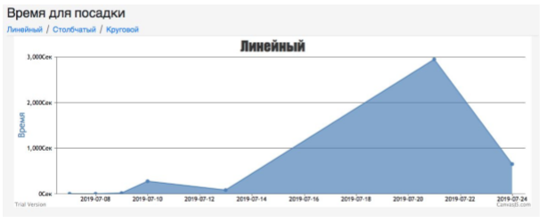

    <h3>Тестовое задание «Микро ЛК #743k»</h3>

 
Данное ТЗ умышленно написано тезисно и специально вас не ограничиваю какими то технологиями, обязательными фрэймворком и тд, тк понимаю что все работали с разными и чтобы условия были примерно равными.  
     
Нужно сделать проект в котором есть:  
* Регистрация, авторизация, разграничение прав на администратора и пользователя
 
* Регистрация пользователя - Поля - почта, телефон, имя, пароль Авторизация происходит по почте и паролю 
     
* Регистрации администратора нет, его создаем вручную 
     
     
В личном кабинете пользователь может  Редактировать информацию о себе (телефон, пароль, имя) 
     
Просмотреть график «времени посадки по дням» 
     
Вот пример его реализации 
     

В таблице ​`session_action` ​  содержится информация нужная нам, посадкой считаются те записи у которых поле `​action_type_raw​` равно «seat» Поле `action_data_raw` - кол-во секунд на это действие 
 
На графике 2 шкалы «время» и «дни» Каждая точка это среднее значение сколько времени ушло на посадку в заданный день 
  
CRUD - записей времен посадки, так же должны присутствовать «id салона» и «id оператора» (они есть в таблице ​`sessions`​) при просмотре записи и когда смотрим все записи на странице «списком» 
 
Итого получается 3 блока/страниц (профиль/график/записи посадки) + дополнительные страницы если нужны 
 
**Администратор может**  
Управлять пользователями, для этого делаем - CRUD - пользователи.
 
*Главная страница​* - это любой шаблон лэндинга, с которого есть ссылки на авторизацию и регистрацию.